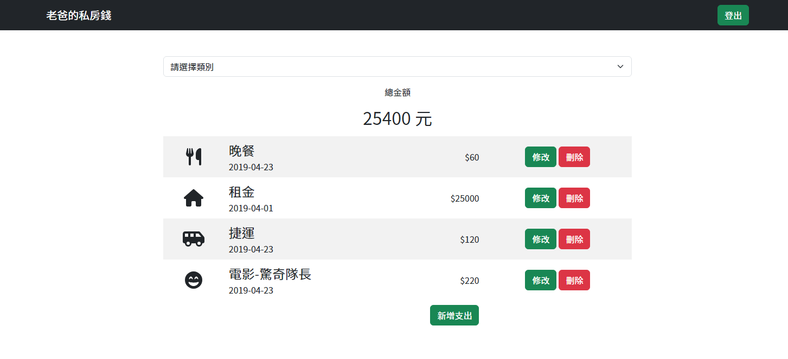

# 老爸的私房錢

## 專案簡介
本專案具有以下功能：
1.  紀錄每筆消費，並能夠依照分類顯示該分類的總花費，以及所有支出的總額。
2.  每位使用者可以建立帳號，維護自己的支出紀錄。

## 網站畫面


## 使用技術


## 安裝流程
### 本地電腦執行
1.  打開終端機，cd 移動到預定放置本專案的資料夾，執行以下指令以複製本專案：
   
    ```
    git clone https://github.com/Taiwania/expense-tracker
    ```

2.  在該專案資料夾中，以終端機方式執行安裝 npm：
    
    ```
    npm install
    ```

3.  安裝完成後，請依照「.env.example」的格式，在專案中新增「.env」檔案並匯入 MONGODB_URI 及 SESSION_SECRET。其中 SESSION_SECRET 可自行更改成英數大小寫的字串。

4.  執行以下指令，匯入本專案的種子資料到 MongoDB 資料庫：

    ```
    npm run seed
    ```

    看到以下訊息代表資料已經匯入 MongoDB：

    ```
    MongoDB is connected!
    The default categories is imported.
    MongoDB is connected!
    Record seed data created.
    ```

5.  最後執行以下指令啟動網站：

    ```
    npm run dev
    ```

    看到以下指令代表網站載入完成，可以使用瀏覽器打開 http://localhost:3310 即可進入網站。

    ```
    The website http://localhost:3310 is online.
    ```

### Heroku 執行
1.  註冊、設定 Heroku 並安裝完 Heroku CLI。

2.  依照「本地電腦執行」章節第 1 至 2 點完成複製專案及安裝 npm。

3.  登入並初始化 Heroku 專案：

    ```
    heroku login
    heroku create
    ```

4.  在 Heroku 網站的專案設定頁面，於 Config Vars 點選 Reveal Config Vars，參考 .env.example 的範例及本地電腦執行章節第 3 點進行設定。

5.  在專案資料夾執行終端機指令，將本專案推送到 Heroku：

    ```
    git push heroku main
    ```

6.  在 Heroku 生成種子資料：

    ```
    heroku run npm run seed -a <自己的 Heroku 專案名稱>
    ```

    完成後即可使用 Heroku 的網站連結操作本網站。